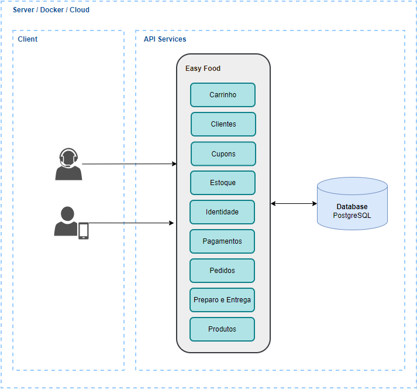

# Intrdução :hamburger:

O Easy Food é um sistema de atendimento e gestão de pedidos para lanchonetes. O objetivo é melhorar a experiência do cliente, reduzindo erros de atendimento e otimizando a processo de realização e entrega de pedidos aos clientes.

O projeto é parte do trabalho de conclusão do curso de Arquitetura de Software da FIAP o intuito é aplicar os conceitos aprendidos durante o curso, como Domain Driven Design, arquitetura de microsserviços, design de APIs, DevOps, etc.

**Para informações maiores informações sobre o projeto, modelo estratatégico, entre outros, acesse a nossa [Wiki](https://5soat-acme.github.io/easy-food/docs/intro)**

# Tecnologias utilizadas :computer:

- .NET 8.0
  - ASP.NET Identity Core
  - ASP.NET Web API
  - Entity Framework Core
- PostgreSQL
- Docker

# Arqiutetura :triangular_ruler:

- Arquitetura Hexagonal
- DDD - Domain Driven Design
- Domain Events
- Domain Validations
- Repository Pattern
- Unit Of Work Pattern
- CQS - Command Query Separation

# Overview da arquitetura :mag:
Na primeira fase do projeto, foi desenvolvido um monolito modular para fazer uma separação clara dos contextos delimitados mapeados na modelagem estratégica. Separamos a implementação em 3 pastas principais:
- **Presentation:** É a camada de que expões os serviços da aplicação. É responsável por receber as requisições HTTP, fazer a validação dos dados de entrada, mapear os dados de entrada para os objetos de domínio, chamar os serviços de aplicação e retornar os dados de saída.
- **Services:** É onde stão implementados os serviços de aplicação. Dentro desta pasta dividimos em subpastas que representam os contextos delimitados. Cada subpasta contém as camadas do serviço, como **Application, Domain, Infra**, entre outras.
- **Shared:** É aqui que compartilhamos o que é comum entre os diferentes módulos, inclusive os objetos de domíno e os serviços de infraestrutura que podem ser utilizados por mais de um contexto delimitado.

### Estrutura
 </br>
 </br>

### Overview


# Como executar :rocket:

A seguir estão as instruções para executar o projeto localmente ou utilizando o Docker.

## Docker :whale:
### Pré-requisitos :clipboard:
- **Docker:** É necessário que o Docker esteja instalado na máquina. Para instalar, siga as instruções do site oficial: https://docs.docker.com/get-docker/

### Executando :running:

Deixamos disponível um arquivo docker-compose.yml para facilitar a execução do projeto. Para executar, basta executar o comando abaixo na raiz do projeto no terminal do seu sistema operacional:

```bash
docker-compose -f docker-compose -f ./deploy/docker/docker-compose-local.yml up -d
```

O comando acima irá criar um container para a aplicação e outro para a base de dados. Além disso, o volume da base também será criado para que os dados sejam persistidos mesmo após a parada do container.
A primeira vez que o volume for criado a criação das tabelas e a inserção dos dados iniciais será feita automaticamente. Caso queira recriar as tabelas e inserir novamente os dados, basta excluir o volume e executar o comando acima outra vez.

## Localmente :computer:
### Pré-requisitos :clipboard:
Antes de tudo precisamos 