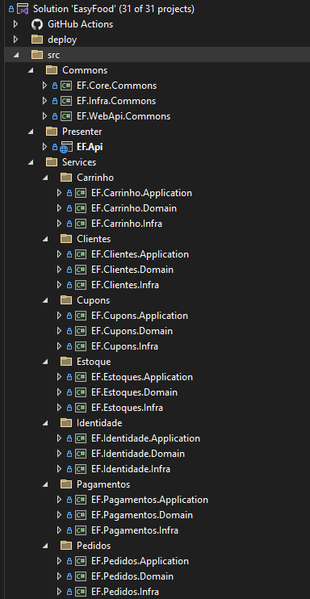
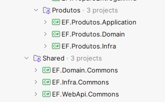
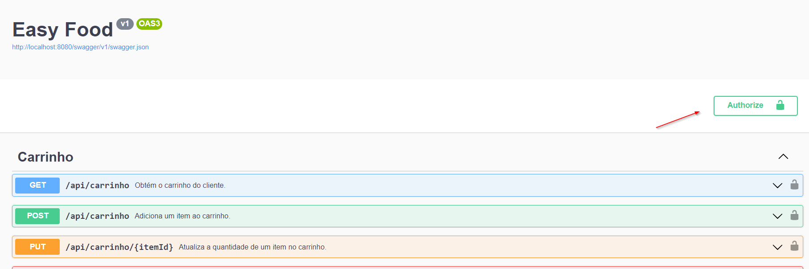
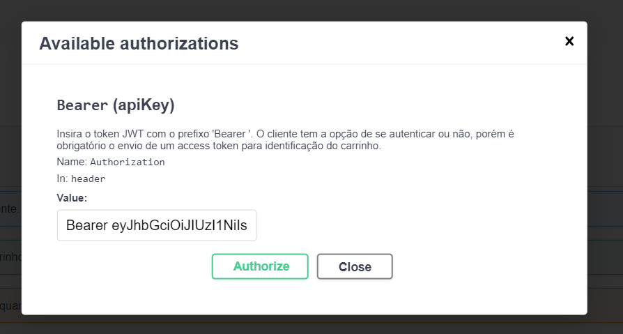
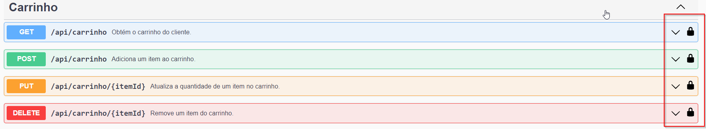

# Introdução :hamburger:

O Easy Food é um sistema de atendimento e gestão de pedidos para lanchonetes. O objetivo é melhorar a experiência do cliente, reduzindo erros de atendimento e otimizando a processo de realização e entrega de pedidos aos clientes.

O projeto é parte do trabalho de conclusão do curso de Arquitetura de Software da FIAP o intuito é aplicar os conceitos aprendidos durante o curso, como Domain Driven Design, arquitetura de microsserviços, design de APIs, DevOps, etc.

**Para maiores informações sobre o projeto, modelo estratatégico, entre outros, acesse a nossa [Wiki](https://5soat-acme.github.io/easy-food/docs/intro)**

## Sumário
1. [Tecnologias utilizadas :computer:](#Tecnologias-utilizadas-computer)
2. [Arquitetura :triangular_ruler:](#Arquitetura-triangular_ruler)
   1. [Introdução :mag:](#Introdução-mag)
   2. [Estrutura do projeto :hammer:](#Estrutura-do-projeto-hammer)
   3. [Clean-Architecture :o:](#Clean-Architecture-o)
   4. [Diagramas da Arquitetura :bar_chart:](#Diagramas-da-Arquitetura-bar_chart)
4. [Como executar :rocket:](#Como-executar-rocket)
    1. [Docker :whale:](#Docker-whale)
        1. [Pré-requisitos :clipboard:](#Pré-requisitos-clipboard)
        2. [Executando :running:](#Executando-running)
        3. [Como utilizar :bulb:](#Como-utilizar-bulb)
    2. [Localmente :computer:](#Localmente-computer)
        1. [Pré-requisitos :clipboard:](#Pré-requisitos-clipboard-1)
        2. [Executando :running:](#Executando-running-1)
        3. [Como utilizar :bulb:](#Como-utilizar-bulb-1)
    3. [AWS - EKS :cloud:](#AWS---EKS-cloud)
        1. [Pré-requisitos :clipboard:](#Pré-requisitos-clipboard-2)
        2. [Executando :running:](#Executando-running-2)
        3. [Como utilizar :bulb:](#Como-utilizar-bulb-2)
    4. [Token :key:](#Token-key)
        1. [Token Webhook :key:](#Token-Webhook-key)
5. [Utilização dos Endpoints :arrow_forward:](#Utilização-dos-Endpoints-arrow_forward)
    1. [Identificação](#Identificação)
    2. [Gestão de Produtos](#Gestão-de-Produtos)
    3. [Carrinho](#Carrinho)
    4. [Pedido](#Pedido)
    5. [Pagamento](#Pagamento)
    6. [Preparação e Entrega](#Preparação-e-Entrega)
    7. [Gestão de Estoque](#Gestão-de-Estoque)
    8. [Cupom](#Cupom)

# Tecnologias utilizadas :computer:

- .NET 8.0
  - ASP.NET Identity Core
  - ASP.NET Web API
  - Entity Framework Core
- PostgreSQL
- Docker

# Arquitetura :triangular_ruler:
## Patterns utilizados
- Clean Architecture
- DDD - Domain Driven Design
- Domain Events
- Domain Validations
- Repository Pattern
- Unit Of Work Pattern

## Introdução :mag:
Foi desenvolvido um monolito modular para fazer uma separação clara dos contextos delimitados mapeados na modelagem estratégica. </br>
O desenvolvimento separado em projetos de forma modular, foi pensado para ficar de uma forma clara e de acordo com o DDD, separando cada contexto em um projeto. Dessa maneira, fica clara a identificação dos contextos e facilita no desenvolvimento, podendo separar o desenvolvimento dos contextos entre os times, sem que haja conflitos. Separamos a implementação em 3 pastas principais:
- **Presenter:** É a camada que expõe os serviços da aplicação. É responsável por receber as requisições HTTP, validar os dados de entrada, injetar as dependências necessárias para a camada de aplicação e retornar para o solicitante os dados de saída.
- **Services:** São os serviços da aplicação separados por contextos delimitados. Cada contexto delimitado possui o seu core (camadas de aplicação e domínio) e infra.
- **Commons:** É aqui que compartilhamos o que é comum entre os diferentes módulos, inclusive os objetos de domíno e os serviços de infraestrutura que podem ser utilizados por mais de um contexto delimitado.

## Estrutura do projeto :hammer:
 </br>
 </br>

## Clean Architecture :o:
 </br>

Como dissemos anteriormente, optamos por desenvolver o projeto em um monolito modular onde cada contexto delimitado é representado por um serviço. Cada serviço possui o seu core e sua camada de infraestrutura.

- **Services.*.Domain:** São os projetos referente a camada **Enterprise Business Rules** da Clean Architecture. São nesses projeto onde está o domínio da aplicação, com as regras de negócio e sem referência a nenhuma bliblioteca ou framework. Esta camada expõe interfaces que serão implementadas nas camadas externas, seguindo a regra de Inversão de Dependência.

- **Services.*.Infra:** Nesses projetos fazemos do padrão Repository um Gateway da camada **Interface Adapters** da Clean Architecture, onde esses Repositories irão chamar um DBContext do ORM(Entity Framework). Nesse cenário, o ORM passa a ser a camada **Frameworks & Drivers** da Clean Architecture. Toda regra de acesso a dados fica na camada mais externa. Quando necessário mudar a forma de acesso a dados, basta implementar uma nova classe com base na interface e chamar uma nova implementação da camada **Frameworks & Drivers**.

- **Services.*.Application:** São os projetos referente a camada **Application Business Rules** da Clean Architecture. São nesses projetos onde são implementados cada UseCase do sistema. Os UseCases recebem via injeção de depêndencia os Gateways(Repositories) e os utilizam de acordo com a regra de negócio necessária.

- **Presenter:** São os Controllers da camada **Interface Adapters** da Clean Architecture. Esses Controllers são responsáveis por chamarem os UseCases passando via injeção de dependência toda dependência necessária, como por exemplo, os Gateways(Repositories). A instanciação desses Gateways são feitas utilizando a Injeção de Dependência já existente no framework do .NET. Nesse cenário a injeção de dependência do framework passa a ser a  camada **Frameworks & Drivers** da Clean Architecture.

## Diagramas da Arquitetura :bar_chart:
A documentação da arquitetura do projeto está centralizada na nossa wiki e pode ser verificada  aqui: **[Wiki](https://5soat-acme.github.io/easy-food/docs/category/diagramas)**


# Como executar :rocket:

A seguir estão as instruções para executar o projeto:
- Utilizando o Docker
- Localmente
- Na AWS usando o EKS.

## Docker :whale:
### Pré-requisitos :clipboard:
É necessário que o **Docker** esteja instalado na máquina. Para instalar, siga as instruções do site oficial: https://docs.docker.com/get-docker/

### Executando :running:

Deixamos disponível um arquivo docker-compose-local.yml para facilitar a execução do projeto. Para executar, basta executar o comando abaixo na raiz do projeto no terminal do seu sistema operacional:

```bash
docker-compose -f ./deploy/docker/docker-compose-local.yml up -d
```

O comando acima irá criar um container para a aplicação e outro para a base de dados. Além disso, o volume da base também será criado para que os dados sejam persistidos mesmo após a parada do container.
A primeira vez que o volume for criado a criação das tabelas e a inserção dos dados iniciais será feita automaticamente. Caso queira recriar as tabelas e inserir novamente os dados, basta excluir o volume e executar o comando acima outra vez.

### Como utilizar :bulb:

Com a aplicação em execução, basta acessar a URL **[http://localhost:8080/swagger](http://localhost:8080/swagger)** para acessar a documentação da API.

## Localmente :computer:
### Pré-requisitos :clipboard:
Para executar localmente certifique-se de ter a sua IDE de preferência instalada, além do **.NET 8.0 SDK**. Para instalar o SDK, siga as instruções do site oficial **[aqui](https://dotnet.microsoft.com/pt-br/download/dotnet/8.0)**. Além disso, é necessário ter o **PostgreSQL** instalado na máquina ou em um container. Para instalar diretamente na sua máquina verifique a documentação **[aqui](https://www.postgresql.org/download/)**. Se preferir utilizar um container, verifique como fazer **[aqui](https://hub.docker.com/_/postgres)**.

### Executando :running:
Com o PostgreSQL instalado e configurado, crie um banco de dados com o nome `easyfood`. Para isso, você pode utilizar o **[pgAdmin](https://www.pgadmin.org/)** ou qualquer outra ferramenta de sua preferência. Após criar o banco de dados, execute o script  **[init.sql](deploy/database/init.sql)** disponível na pasta **[./deploy/database](deploy/database)**. Esse script irá criar as tabelas e inserir os dados iniciais.
Certifique-se de colocar a string de conexão correta no arquivo **[appsettings.json](src/Presentation/EF.Api/appsettings.json)**.
Pronto!

### Como utilizar :bulb:
Agora é só executar a aplicação utilizando a sua IDE de preferência. A documentação estará disponível na URL **[http://localhost:[PORTA]/swagger](http://localhost:5002/swagger) (substitua pela porta em que a aplicação está rodando)**.

## AWS - EKS :cloud:
### Pré-requisitos :clipboard:
- Para o correto funcionamento do workflow é necessário configurar as seguintes secrets no repositório, de acordo com a conta da AWS Academy e da conta do Docker Hub:
    - AWS_ACCESS_KEY_ID
    - AWS_SECRET_ACCESS_KEY
    - AWS_SESSION_TOKEN
    - DOCKERHUB_TOKEN
- Ter a infraestrutura dos seguintes repositórios já criadas:
    - [easy-food-infra](https://github.com/5soat-acme/easy-food-infra)
    - [easy-food-infra-database](https://github.com/5soat-acme/easy-food-infra-database)
    - [easy-food-lambda](https://github.com/5soat-acme/easy-food-lambda)

### Executando :running:
- O repositório conta com um workflow disparado quando houver **push** na branch **main**. O workflow é utilizado para: 
    - Criar a imagem da API e publicar no **[Docker Hub](https://hub.docker.com/r/5soatacme/easy-food)**.
    - Executar ```rollout restart``` no deployment do cluster EKS criado pelo repositório **[easy-food-infra](https://github.com/5soat-acme/easy-food-infra)**.


### Como utilizar :bulb:

Após toda a infraestrutura criada:
- Configurar **kubeconfig** com o comando
```
aws eks update-kubeconfig --region us-east-1 --name easy-food
```
- Com o comando abaixo buscar o link do LoadBalancer criado pelo Ingress NGINX Controller.
```
kubectl get service -n nginx-ingress
```

A URL de acesso será o conteúdo da coluna **EXTERNAL-IP** do serviço de tipo LoadBalancer.
A documentação estará disponível em: **EXTERNAL-IP/swagger**


## Token :key:

Para manter a associação de clientes com um carrinho estamos utilizando um **[Json Web Token (JWT)](https://jwt.io/)**. Para as requisições no contexto de **pedidos e carrinho**, é necessário informar o token no header da requisição. Para isso, basta copiar o token gerado pelo Cognito ao efetuar login de um usuário cadastrado e incluir o token no header da requisição com a chave `Authorization` e a palavra `Bearer` seguida do token gerado. Exemplos de utilização do Cognito estão no repositório  **[easy-food-lambda](https://github.com/5soat-acme/easy-food-lambda)**. <br>
Caso queira efetuar o pedido sem possuir um cadastro, basta utilizar o endpoint ``[GET] /api/identidade/acessar`` para recuperar um token sem necessidade de cadastro.


Incluimos no swagger um botão para facilitar a inclusão do token no header. Basta clicar no botão **Authorize** e colar o token no campo **Value**. Após isso, basta clicar em **Authorize** e o token será incluído automaticamente no header de todas as requisições.




O mesmo pode ser feito na requisição de cada endpoint:



### Token Webhook :key:
Para chamada do Webhook é necessário a utilização de um Token. O Token a ser utilizado é o informado no campo **Key** da tag **PagamentoAutorizacaoWebHook** do arquivo **appsettings.json**.
O Token pré-configurado foi o **9E541194-61B4-44F6-BE2A-B1F08C24BB52**


# Utilização dos Endpoints :arrow_forward:

### Identificação
2. O Cliente pode acessar o sistema sem cadastro em: ``[GET] /api/identidade/acessar`` </br>
Este gera um token JWT (JSON Web Token) que deve ser usado em cabeçalhos de autenticação para futuras requisições.

### Gestão de Produtos
1. Pode-se consultar o cardápio dividido por categoria em: ``[GET] /api/produtos`` </br>
Essa consulta é utilizada para a demonstração do cardápio e para a gestão de produtos.
2. Pode-se cadastrar um produto em: ``[POST] /api/produtos``
3. Pode-se atualizar um produto em: ``[PUT] /api/produtos/{id}``
4. Pode-se remover um produto em: ``[DELETE] /api/produtos/{id}``

### Carrinho
1. Pode-se adicionar um item ao carrinho em: ``[POST] /api/carrinho``
2. Pode-se atualizar um item no carrinho em: ``[PUT] /api/carrinho/{itemId}``
3. Pode-se remover um item no carrinho em: ``[DELETE] /api/carrinho/{itemId}``
4. Pode-se consultar um carrinho em: ``[GET] /api/carrinho`` </br>
Obtém o carrinho do cliente. Caso o cliente tenha se identificado no sistema, é verificado se o mesmo possui um carrinho em aberto. Para clientes não identificados, é criado um carrinho temporário associado ao token gerado para o usuário anônimo. Esse endpoint é utilizado para exibir os dados na tela de carrinho e o resumo do pedido antes da confirmação.

### Pedido
1. Pode-se efetuar o checkout do pedido em: ``[POST] /api/pedidos/checkout``
2. Pode-se consultar o pedido em: ``[GET] /api/pedidos/{id}``

### Pagamento
1. Pode-se efetuar o pagamento em: ``[POST] /api/pagamentos``
2. Pode-se autorizar o pagamento via webhook em: ``[POST] /api/pagamentos/autorizar/webhook``
3. Pode-se consultar o pagamento de um pedido em: ``[GET] /api/pagamentos``
3. Pode-se consultar os tipos de pagamentos disponíveis em: ``[GET] /api/pagamentos/tipos``

### Preparação e Entrega
1. Pode-se consultar pedidos, filtrando por status em: ``[GET] /api/preparo`` </br>
Este endpoint exibe todos os pedidos independente do status na seguinte ordem: Pronto > Em Preparação > Recebido > Finalizado. Também é possível filtrar por um status em específico.
2. Pode-se consultar os pedidos que serão exibidos no monitor de acompanhamento em: ``[GET] /api/monitor`` </br>
Este endpoint é utilizado na exibição dos pedidos em um monitor para visualização dos clientes. É exibido todos os pedidos, exceto os finalizados, na seguinte ordem: Pronto > Em Preparação > Recebido.
3. Pode-se consultar um pedido específico em: ``[GET] /api/preparo/{id}``
4. Pode-se iniciar o pedido em: ``[POST] /api/preparo/iniciar``
5. Pode-se finalizar o pedido em: ``[POST] /api/preparo/finalizar``
6. Pode-se confirmar entrega do pedido em: ``[POST] /api/preparo/confirmar-entrega`` </br>
**Preparação e Entrega** é um contexto diferente de **Pedido**. Dessa forma a atualização do status do pedido é feito no contexto de **Preparação e Entrega** com o **id** do pedido da **Preparação e Entrega**. O status no contexto de **Pedido** é atualizado de forma automática.

### Gestão de Estoque
1. Pode-se consultar o estoque de um produto em: ``[GET] /api/estoques/{produtoId}``
2. Pode-se adicionar ou remover quantidade em estoque do produto em em: ``[POST] /api/estoques`` </br>
O sistema já faz a baixa de estoque de forma automática na criação do pedido, não sendo necessário chamar o endpoint para fazer a baixa. Esse endpoint pode ser utilizado para dar entrada no estoque de um produto.

### Cupom
1. Pode-se consultar um cupom vigente em: ``[GET] /api/cupons/{codigoCupom}``
2. Pode-se criar um cupom em: ``[POST] /api/cupons``
3. Pode-se atualizar um cupom em: ``[PUT] /api/cupons/{cupomId}``
4. Pode-se inativar um cupom em: ``[PUT] /api/cupons/inativar/{cupomId}``
5. Pode-se remover produtos do cupom em: ``[DELETE] /api/cupons/{cupomId}/remover-produtos``
6. Pode-se inserir produtos ao cupom em: ``[PUT] /api/cupons/{cupomId}/inserir-produtos``

</br>
</br>

**Pronto! Agora você já pode utilizar a API** :smile: