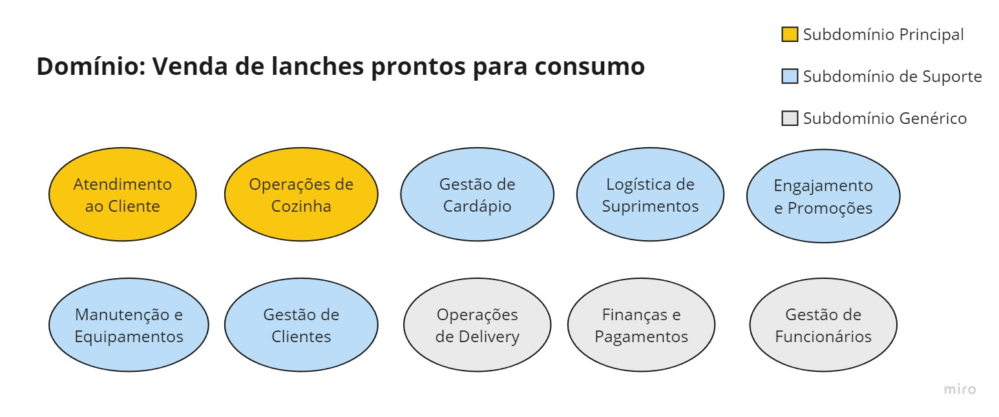

# Easy Food :rocket:

O **Easy Food** é um sistema de atendimento e gestão de pedidos para lanchonetes. O objetivo é melhorar a experiência do cliente, reduzindo erros de atendimento e otimizando a processo de realização e entrega de pedidos aos clientes.

O projeto é parte do trabalho de conclusão do curso de **Arquitetura de Software da FIAP** o intuito é aplicar os conceitos aprendidos durante o curso, como Domain Driven Design, arquitetura de microsserviços, design de APIs, DevOps, etc.

# Desenvolvedores :man_technologist:

- [Lucas Fernandes](https://github.com/Lukiita)
- [Luis Guilherme](https://github.com/Lguilhermeg)
- [Pedro Barão](https://github.com/pedrobarao)
- [Rafael Casadei](https://github.com/RafaCasadei)
- [Rorigo Lima](https://github.com/Rodrigo1895)

# Ferramentas e tecnologias utilizadas :toolbox:

# O problema :confused:

Há uma lanchonete de bairro que está expandindo devido seu grande sucesso. Porém, com a expansão e sem um sistema de controle de pedidos, o atendimento aos clientes pode ser caótico e confuso. Por exemplo, imagine que um cliente faça um pedido complexo, como um hambúrguer personalizado com ingredientes específicos, acompanhado de batatas fritas e uma bebida. O atendente pode anotar o pedido em um papel e entregá-lo à cozinha, mas não há garantia de que o pedido será preparado corretamente.

Sem um sistema de controle de pedidos, pode haver confusão entre os atendentes e a cozinha, resultando em atrasos na preparação e entrega dos pedidos. Os pedidos podem ser perdidos, mal interpretados ou esquecidos, levando à insatisfação dos clientes e a perda de negócios.

Em resumo, um sistema de controle de pedidos é essencial para garantir que a lanchonete possa atender os clientes de maneira eficiente, gerenciando seus pedidos e estoques de forma adequada. Sem ele, expandir a lanchonete pode acabar não dando certo, resultando em clientes insatisfeitos e impactando os negócios de forma negativa.

Para solucionar o problema, a lanchonete irá investir em um sistema de autoatendimento de fast food, que é composto por uma série de dispositivos e interfaces que permitem aos clientes selecionar e fazer pedidos sem precisar interagir com um atendente, com as seguintes funcionalidades:

### Pedido :spiral_notepad:

Os clientes são apresentados a uma interface de seleção na qual podem optar por se identificarem via CPF, se cadastrarem com nome, e-mail ou não se identificar, podendo montar o combo na seguinte sequência, sendo todas elas opcionais:

1. Lanche
2. Acompanhamento
3. Bebida
4. Sobremesa

Em cada etapa é exibido o nome, descrição e preço de cada produto.

### Pagamento :moneybag:

O sistema deverá possuir uma opção de pagamento integrada para MVP. A forma de pagamento oferecida será via QRCode do Mercado Pago.

### Acompanhamento :clock2:

Uma vez que o pedido é confirmado e pago, ele é enviado para a cozinha para ser preparado. Simultaneamente deve aparecer em um monitor para o cliente acompanhar o progresso do seu pedido com as seguintes etapas:

- Recebido
- Em preparação
- Pronto
- Finalizado
- Entrega

### Entrega :+1:

Quando o pedido estiver pronto, o sistema deverá notificar o cliente que ele está pronto para retirada. Ao ser retirado, o pedido deve ser atualizado para o status finalizado.

### Além das etapas do cliente, o estabelecimento precisa de um acesso administrativo:

### Gerenciar Clientes :curly_haired_woman:

Com a identificação dos clientes o estabelecimento pode trabalhar em campanhas promocionais.

### Gerenciar produtos e categorias :hamburger:

Os produtos dispostos para escolha do cliente serão gerenciados pelo estabelecimento, definindo nome, categoria, preço, descrição e imagens. Para esse sistema teremos categorias fixas

- Lanche
- Acompanhamento
- Bebida
- Sobremesa

### Acompanhamento e pedidos :desktop_computer:

Deve ser possível acompanhar os pedidos em andamento e tempo de espera de cada pedido.

As informações dispostas no sistema de pedidos precisarão ser gerenciadas pelo estabelecimento através de um painel administrativo.

# Modelo estratégico :world_map:

Toda a documentação do projeto pode ser encontrada na pasta [docs](./docs). A seguir estão os principais artefatos gerados durante a fase de modelagem estratégica.

## Mapeamento de Subdomínios :compass:

### **Subdomínios Principais** :star2:

- **Atendimento ao Cliente**: Responsável pela interface de autoatendimento, processamento de pedidos, acompanhamento do status do pedido e notificações ao cliente.
- **Operações de Cozinha**: Gerencia a recepção de pedidos, a preparação de alimentos conforme as especificações do pedido, e a comunicação do status do pedido de volta ao sistema de atendimento.

### **Subdomínios de Suporte** :building_construction:

- **Gestão de Cardápio**: Cuida da criação, atualização e remoção de itens do cardápio, incluindo preços, descrições e imagens.
- **Logística de Suprimentos**: Abrange a compra de ingredientes e materiais, o controle de estoque e a previsão de necessidades com base na demanda.
- **Engajamento e Promoções**: Foca em campanhas de marketing, programas de fidelidade, e promoções para atrair e reter clientes.
- **Manutenção e Equipamentos**: Encarregado da manutenção dos equipamentos da lanchonete, incluindo terminais de autoatendimento e maquinário de cozinha.
- **Gestão de Clientes**: Administra as contas dos clientes, incluindo dados pessoais, preferências, histórico de pedidos e autenticação.

### **Subdomínios Genéricos** :cloud:

- **Serviços de Entrega**: Se aplicável, gerencia a logística de entrega de pedidos, incluindo a coordenação de entregadores e o rastreamento de entregas.
- **Finanças e Pagamentos**: Processa transações financeiras, gerencia métodos de pagamento e mantém registros financeiros.
- **Gestão de Funcionários**: Lida com a administração de recursos humanos, como escalas de trabalho, atribuições de tarefas e avaliação de desempenho.

## Linguagem ubíqua :speech_balloon:

A linguagem ubíqua (ou onipresente) é de grande importância para se manter a comunicação entre as partes envolvidas no projeto. Para isso, foi criado um [dicionário de linguagem ubíqua](https://docs.google.com/spreadsheets/d/1HN4Y6cAw2v0psgqNHx81DKBh5wbbWqqGNv-7q7sG3E4/edit#gid=1623871174) para que todos os possam consultar e entender o significado de cada termo utilizado no projeto.

## Domain Storytteeling :flashlight:

### :large_blue_diamond: Fluxo 1 - Pedido e Pagamento

Este é o fluxo principal onde o cliente faz um pedido no sistema de atendimento e realiza o pagamento.

.png>)

#### :large_orange_diamond: Fluxo 1.1.1 - Falha no pagamento

Fluxo alternativo onde o sistema informa ao cliente que o pagamento foi recusado e o mesmo faz troca da forma de pagamento.

.png>)

#### :large_orange_diamond: Fluxo 1.1.2 - Falha no pagamento

Fluxo alternativo onde o sistema informa ao cliente que o pagamento foi recusado e o mesmo faz cancela o pedido.

.png>)

#### :large_orange_diamond: Fluxo 1.2.1 - Estoque indisponível

Fluxo alternativo onde algum dos produtos selecionados pelo cliente tem o estoque esgotado e o mesmo altera o pedido.

.png>)

#### :large_orange_diamond: Fluxo 1.2.2 - Estoque indisponível

Fluxo alternativo onde algum dos produtos selecionados pelo cliente tem o estoque esgotado e o mesmo cancela o pedido.

.png>)

### :large_blue_diamond: Fluxo 2 - Preparo e Entrega

Fluxo principal da preparação e entrega do pedido ao cliente.

#### :large_orange_diamond: Fluxo 2.1.1 - Pedido não conforme

Fluxo alternativo em que o cliente recebe o pedido com alguma divergência e o mesmo é ajustado.

#### :large_orange_diamond: Fluxo 2.2 - Cliente cancela o pedido

Fluxo alternativo em que o cliente cancela o pedido enquanto o ainda não foi iniciada a preparação.

.png>)

## Event Storming :umbrella:

## Diagrama de Contexto :checkered_flag:
