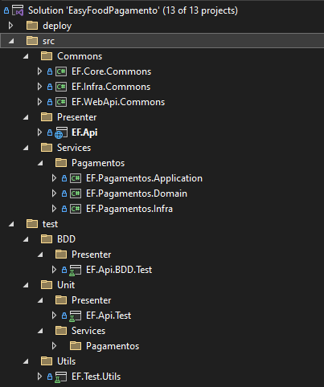
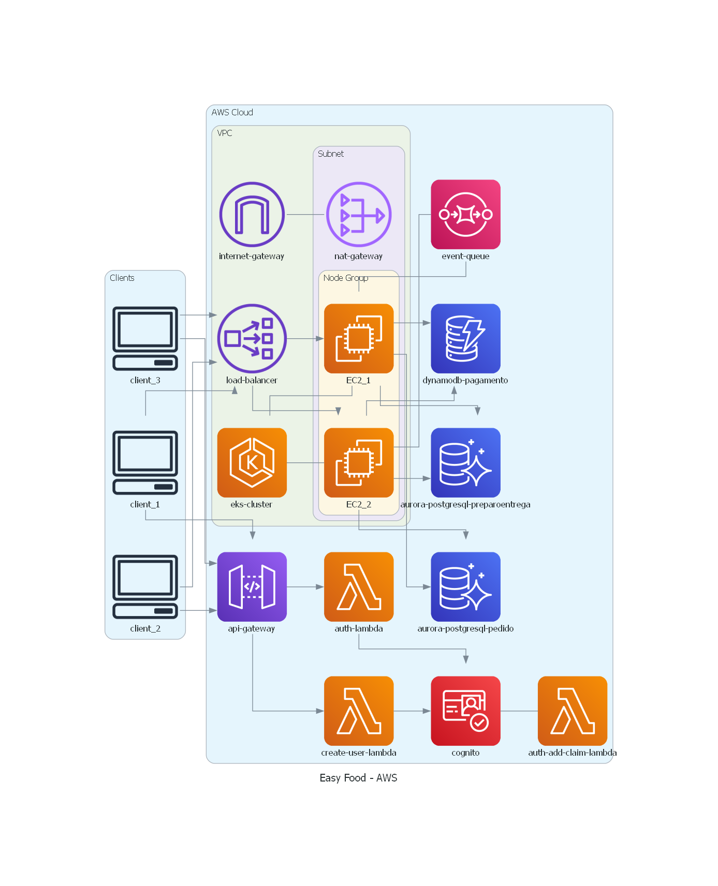
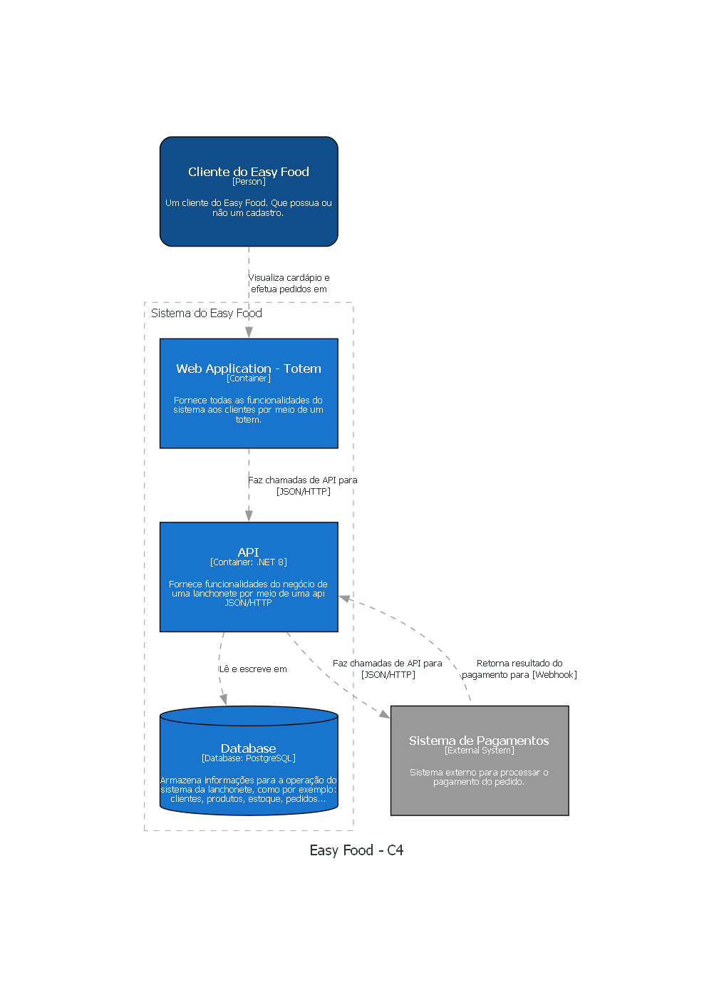

# Introdução :hamburger:

O Easy Food é um sistema de atendimento e gestão de pedidos para lanchonetes. O objetivo é melhorar a experiência do cliente, reduzindo erros de atendimento e otimizando a processo de realização e entrega de pedidos aos clientes.

O projeto é parte do trabalho de conclusão do curso de Arquitetura de Software da FIAP o intuito é aplicar os conceitos aprendidos durante o curso, como Domain Driven Design, arquitetura de microsserviços, design de APIs, DevOps, etc.

**Para maiores informações sobre o projeto, modelo estratatégico, entre outros, acesse a nossa [Wiki de Documentação](https://5soat-acme.github.io/easy-food/docs/intro)**

# Repositórios
Este repositório visa concentrar a documentação do projeto. Os projetos de microsserviços e de criação de infraestrutura estão presentes nos repositórios listados abaixo:
- Microsserviços
    - [easy-food-pedido](https://github.com/5soat-acme/easy-food-pedido)
    - [easy-food-pagamento](https://github.com/5soat-acme/easy-food-pagamento)
    - [easy-food-preparoentrega](https://github.com/5soat-acme/easy-food-preparoentrega)
- Infraestrutura K8S e Mensageria
    - [easy-food-infra](https://github.com/5soat-acme/easy-food-infra)
- Infraestrutura de Banco de Dados
    - [easy-food-infra-database](https://github.com/5soat-acme/easy-food-infra-database)
- Infraestrutura de recursos Lambda
    - [easy-food-lambda](https://github.com/5soat-acme/easy-food-lambda)

# Tecnologias utilizadas :computer:
- .NET 8.0
  - ASP.NET Web API
  - Entity Framework Core
- PostgreSQL
- Docker
- Kubernetes
- Helm
- AWS
  - EKS
  - RDS Aurora PostgreSQL
  - DynamoBD
  - SQS
  - Cognito
  - Lambda (utilizando Python)
  - API Gateway  

# Arquitetura :triangular_ruler:
## Patterns utilizados
- Microsserviços
- Clean Architecture
- DDD - Domain Driven Design
- Domain Events
- Domain Validations
- Repository Pattern
- Unit Of Work Pattern
- Mensageria (AWS SQS)

## Introdução :mag:
Foi desenvolvida uma aplicação em microsserviços para fazer uma separação clara dos contextos delimitados mapeados na modelagem estratégica. </br>
O desenvolvimento foi pensado para ficar de uma forma clara e de acordo com o DDD, separando cada contexto em um projeto. Dessa maneira, fica clara a identificação dos contextos e facilita no desenvolvimento, podendo separar o desenvolvimento dos contextos entre os times, sem que haja conflitos. Separamos a implementação em 3 pastas principais:
- **Presenter:** É a camada que expõe os serviços da aplicação. É responsável por receber as requisições HTTP, validar os dados de entrada, injetar as dependências necessárias para a camada de aplicação e retornar para o solicitante os dados de saída.
- **Services:** São os serviços da aplicação separados por contextos delimitados. Cada contexto delimitado possui o seu core (camadas de aplicação e domínio) e infra.
- **Commons:** É aqui que compartilhamos o que é comum entre os diferentes módulos, inclusive os objetos de domíno e os serviços de infraestrutura que podem ser utilizados por mais de um contexto delimitado.

## Estrutura do projeto :hammer:
Todos os 3 microsserviços seguem o mesmo padrão, para a explicação pegamos como base o microsserviço de **Pagamento**.

 </br>

## Clean Architecture :o:
 </br>

Cada serviço possui o seu core e sua camada de infraestrutura.

- **Services.*.Domain:** São os projetos referente a camada **Enterprise Business Rules** da Clean Architecture. São nesses projeto onde está o domínio da aplicação, com as regras de negócio e sem referência a nenhuma bliblioteca ou framework. Esta camada expõe interfaces que serão implementadas nas camadas externas, seguindo a regra de Inversão de Dependência.

- **Services.*.Infra:** Nesses projetos fazemos do padrão Repository um Gateway da camada **Interface Adapters** da Clean Architecture, onde esses Repositories irão chamar um DBContext do ORM(Entity Framework). Nesse cenário, o ORM passa a ser a camada **Frameworks & Drivers** da Clean Architecture. Toda regra de acesso a dados fica na camada mais externa. Quando necessário mudar a forma de acesso a dados, basta implementar uma nova classe com base na interface e chamar uma nova implementação da camada **Frameworks & Drivers**.

- **Services.*.Application:** São os projetos referente a camada **Application Business Rules** da Clean Architecture. São nesses projetos onde são implementados cada UseCase do sistema. Os UseCases recebem via injeção de depêndencia os Gateways(Repositories) e os utilizam de acordo com a regra de negócio necessária.

- **Presenter:** São os Controllers da camada **Interface Adapters** da Clean Architecture. Esses Controllers são responsáveis por chamarem os UseCases passando via injeção de dependência toda dependência necessária, como por exemplo, os Gateways(Repositories). A instanciação desses Gateways são feitas utilizando a Injeção de Dependência já existente no framework do .NET. Nesse cenário a injeção de dependência do framework passa a ser a  camada **Frameworks & Drivers** da Clean Architecture.

## Diagramas da Arquitetura :bar_chart:

### AWS


### K8S


### C4 - Nível 2



# Como executar - AWS:rocket:
A seguir estão as instruções para executar o projeto

## Pré-requisitos :clipboard:
- Para o correto funcionamento do workflow dos repósitórios, é necessário configurar as seguintes secrets no GitHub, de acordo com a conta da AWS Academy, da conta do Docker Hub e da conta do SonarCloud:
    - AWS_ACCESS_KEY_ID
    - AWS_SECRET_ACCESS_KEY
    - AWS_SESSION_TOKEN
    - AWS_REGION
    - DOCKERHUB_TOKEN
    - SONAR_TOKEN
    - DATABASE_PASSWORD
- Criar a infraestrutura dos seguintes repositórios, seguindo a documentação presente em cada repositório:
    - [easy-food-infra](https://github.com/5soat-acme/easy-food-infra)
    - [easy-food-infra-database](https://github.com/5soat-acme/easy-food-infra-database)
    - [easy-food-lambda](https://github.com/5soat-acme/easy-food-lambda)
- Os repositórios dos microsserviços possuem workflow para atualização da imagem no DockerHub e automatização co SonarCloud
    - [easy-food-pedido](https://github.com/5soat-acme/easy-food-pedido)
    - [easy-food-pagamento](https://github.com/5soat-acme/easy-food-pagamento)
    - [easy-food-preparoentrega](https://github.com/5soat-acme/easy-food-preparoentrega)

## Como utilizar :bulb:

Após toda a infraestrutura criada:
- Configurar **kubeconfig** com o comando
```
aws eks update-kubeconfig --region us-east-1 --name easy-food
```
- Com o comando abaixo buscar o link do LoadBalancer criado pelo Ingress NGINX Controller.
```
kubectl get service -n nginx-ingress
```

A URL de acesso será o conteúdo da coluna **EXTERNAL-IP** do serviço de tipo LoadBalancer.
A documentação estará disponível em: 
 - EXTERNAL-IP/pedido/swagger
 - EXTERNAL-IP/pagamento/swagger
 - EXTERNAL-IP/pedidoentrega/swagger


## Token :key:

Para manter a associação de clientes com um carrinho estamos utilizando um **[Json Web Token (JWT)](https://jwt.io/)**. Para as requisições no contexto de **pedidos e carrinho**, é necessário informar o token no header da requisição. Para isso, basta copiar o token gerado pelo Cognito ao efetuar login de um usuário cadastrado e incluir o token no header da requisição com a chave `Authorization` e a palavra `Bearer` seguida do token gerado. Exemplos de utilização do Cognito estão no repositório  **[easy-food-lambda](https://github.com/5soat-acme/easy-food-lambda)**. <br>
Caso queira efetuar o pedido sem possuir um cadastro, basta utilizar o endpoint ``[GET] /api/identidade/acessar`` para recuperar um token sem necessidade de cadastro.


Incluimos no swagger um botão para facilitar a inclusão do token no header. Basta clicar no botão **Authorize** e colar o token no campo **Value**. Após isso, basta clicar em **Authorize** e o token será incluído automaticamente no header de todas as requisições.


O mesmo pode ser feito na requisição de cada endpoint:


### Token Webhook :key:
Para chamada do Webhook é necessário a utilização de um Token. O Token a ser utilizado é o informado no campo **Key** da tag **PagamentoAutorizacaoWebHook** do arquivo **appsettings.json**.
O Token pré-configurado foi o **9E541194-61B4-44F6-BE2A-B1F08C24BB52**


# Utilização dos Endpoints :arrow_forward:

### Identificação
2. O Cliente pode acessar o sistema sem cadastro em: ``[GET] pedido/api/identidade/acessar`` </br>
Este gera um token JWT (JSON Web Token) que deve ser usado em cabeçalhos de autenticação para futuras requisições.

### Gestão de Produtos
1. Pode-se consultar o cardápio dividido por categoria em: ``[GET] pedido/api/produtos`` </br>
Essa consulta é utilizada para a demonstração do cardápio e para a gestão de produtos.
2. Pode-se cadastrar um produto em: ``[POST] pedido/api/produtos``
3. Pode-se atualizar um produto em: ``[PUT] pedido/api/produtos/{id}``
4. Pode-se remover um produto em: ``[DELETE] pedido/api/produtos/{id}``

### Carrinho
1. Pode-se adicionar um item ao carrinho em: ``[POST] pedido/api/carrinho``
2. Pode-se atualizar um item no carrinho em: ``[PUT] pedido/api/carrinho/{itemId}``
3. Pode-se remover um item no carrinho em: ``[DELETE] pedido/api/carrinho/{itemId}``
4. Pode-se consultar um carrinho em: ``[GET] pedido/api/carrinho`` </br>
Obtém o carrinho do cliente. Caso o cliente tenha se identificado no sistema, é verificado se o mesmo possui um carrinho em aberto. Para clientes não identificados, é criado um carrinho temporário associado ao token gerado para o usuário anônimo. Esse endpoint é utilizado para exibir os dados na tela de carrinho e o resumo do pedido antes da confirmação.

### Pedido
1. Pode-se efetuar o checkout do pedido em: ``[POST] pedido/api/pedidos/checkout``
2. Pode-se consultar o pedido em: ``[GET] pedido/api/pedidos/{id}``

### Pagamento
1. Pode-se efetuar o pagamento em: ``[POST] pagamento/api/pagamentos``
2. Pode-se autorizar o pagamento via webhook em: ``[POST] pagamento/api/pagamentos/autorizar/webhook``
3. Pode-se consultar o pagamento de um pedido em: ``[GET] pagamento/api/pagamentos``
3. Pode-se consultar os tipos de pagamentos disponíveis em: ``[GET] pagamento/api/pagamentos/tipos``

### Preparação e Entrega
1. Pode-se consultar pedidos, filtrando por status em: ``[GET] preparoentrega/api/preparo`` </br>
Este endpoint exibe todos os pedidos independente do status na seguinte ordem: Pronto > Em Preparação > Recebido > Finalizado. Também é possível filtrar por um status em específico.
2. Pode-se consultar os pedidos que serão exibidos no monitor de acompanhamento em: ``[GET] preparoentrega/api/monitor`` </br>
Este endpoint é utilizado na exibição dos pedidos em um monitor para visualização dos clientes. É exibido todos os pedidos, exceto os finalizados, na seguinte ordem: Pronto > Em Preparação > Recebido.
3. Pode-se consultar um pedido específico em: ``[GET] preparoentrega/api/preparo/{id}``
4. Pode-se iniciar o pedido em: ``[POST] preparoentrega/api/preparo/iniciar``
5. Pode-se finalizar o pedido em: ``[POST] preparoentrega/api/preparo/finalizar``
6. Pode-se confirmar entrega do pedido em: ``[POST] preparoentrega/api/preparo/confirmar-entrega`` </br>
**Preparação e Entrega** é um contexto diferente de **Pedido**. Dessa forma a atualização do status do pedido é feito no contexto de **Preparação e Entrega** com o **id** do pedido da **Preparação e Entrega**. O status no contexto de **Pedido** é atualizado de forma automática.

### Gestão de Estoque
1. Pode-se consultar o estoque de um produto em: ``[GET] pedido/api/estoques/{produtoId}``
2. Pode-se adicionar ou remover quantidade em estoque do produto em em: ``[POST] pedido/api/estoques`` </br>
O sistema já faz a baixa de estoque de forma automática na criação do pedido, não sendo necessário chamar o endpoint para fazer a baixa. Esse endpoint pode ser utilizado para dar entrada no estoque de um produto.

### Cupom
1. Pode-se consultar um cupom vigente em: ``[GET] pedido/api/cupons/{codigoCupom}``
2. Pode-se criar um cupom em: ``[POST] pedido/api/cupons``
3. Pode-se atualizar um cupom em: ``[PUT] pedido/api/cupons/{cupomId}``
4. Pode-se inativar um cupom em: ``[PUT] pedido/api/cupons/inativar/{cupomId}``
5. Pode-se remover produtos do cupom em: ``[DELETE] pedido/api/cupons/{cupomId}/remover-produtos``
6. Pode-se inserir produtos ao cupom em: ``[PUT] pedido/api/cupons/{cupomId}/inserir-produtos``

</br>
</br>

**Pronto! Agora você já pode utilizar a API** :smile: