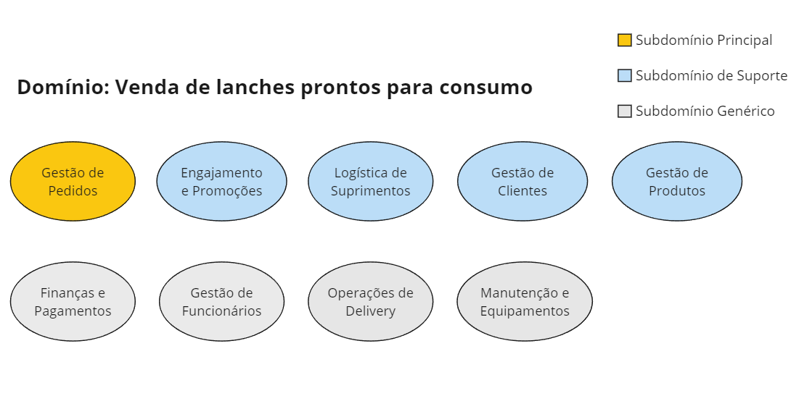

# Mapa de Subdomínios

### **Subdomínios Principais** :compass:

- **Gestão de Pedidos**: Responsável pela interface de autoatendimento, processamento de pedidos, acompanhamento do status do pedido e notificações ao cliente.
- **Preparação e Entrega**: Gerencia a recepção de pedidos, a preparação de alimentos conforme as especificações do pedido, e a comunicação do status do pedido de volta ao sistema de atendimento.

### **Subdomínios de Suporte** :building_construction:

- **Engajamento e Promoções**: Foca em campanhas de marketing, programas de fidelidade, e promoções para atrair e reter clientes.
- **Logística de Suprimentos**: Abrange a compra de ingredientes e materiais, o controle de estoque e a previsão de necessidades com base na demanda.
- **Gestão de Clientes**: Administra as contas dos clientes, incluindo dados pessoais, preferências, histórico de pedidos e autenticação.
- **Gestão de Cardápio**: Cuida da criação, atualização e remoção de itens do cardápio, incluindo preços, descrições e imagens.

### **Subdomínios Genéricos** :cloud:

- **Finanças e Pagamentos**: Processa transações financeiras, gerencia métodos de pagamento e mantém registros financeiros.
- **Gestão de Funcionários**: Lida com a administração de recursos humanos, como escalas de trabalho, atribuições de tarefas e avaliação de desempenho.
- **Operações de Delivery**: Se aplicável, gerencia a logística de entrega de pedidos, incluindo a coordenação de entregadores e o rastreamento de entregas.
- **Manutenção e Equipamentos**: Encarregado da manutenção dos equipamentos da lanchonete, incluindo terminais de autoatendimento e maquinário de cozinha.
